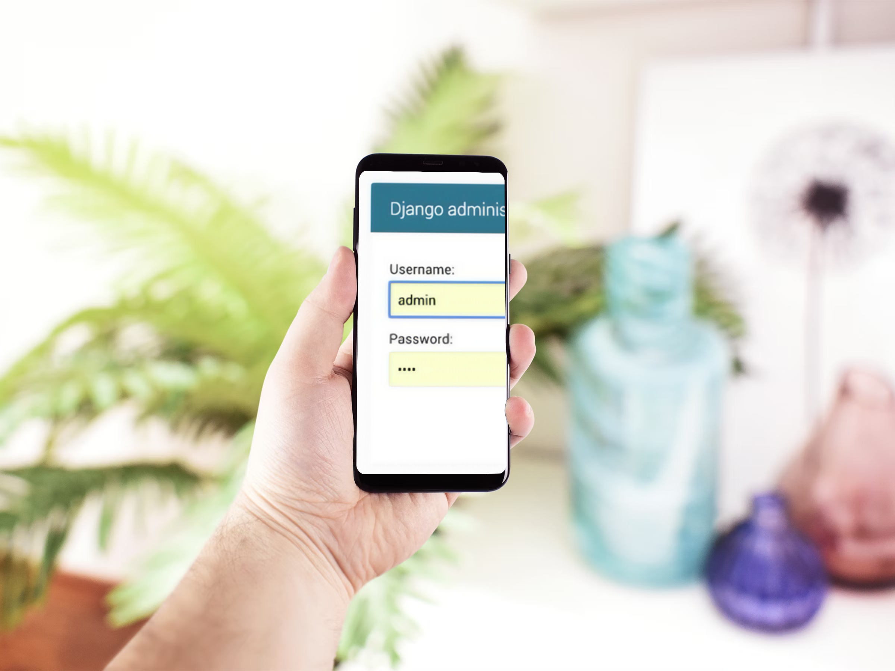
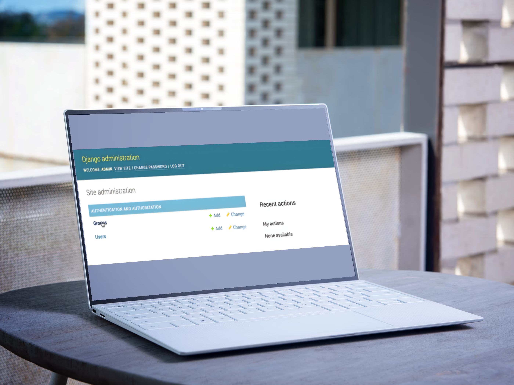
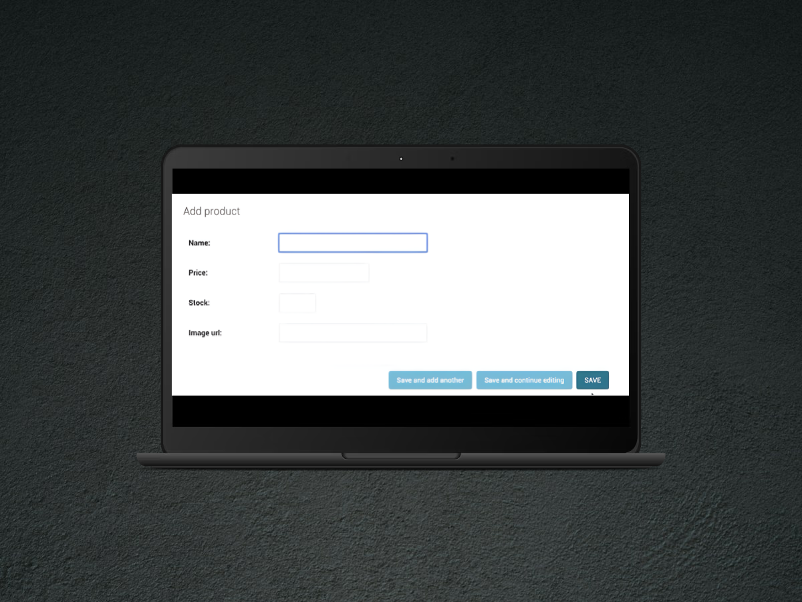

# 🛒 Aprozar Digital

---

## 📋 Table of Contents
- 🏷️ [Project Description](#project-description)
- 📷 [Screenshots](#screenshots)
- ✨ [Features](#features)
- 🛠️ [Technologies](#technologies)
- 🗂️ [Project Structure](#project-structure)
- ⚙️ [Requirements](#requirements)
- 💾 [Installation](#installation)
- ▶️ [Usage](#usage)
- 🧪 [Running Tests](#running-tests)
- 📦 [Deployment](#deployment)
- ⚠️ [Notes](#notes)
- 🫱🏻‍🫲🏼 [Contributing](#contributing)
- 📜 [License](#license)
- 👨🏻‍💻 [Author](#author--acknowledgments--contact) / 🙏🏻 [Acknowledgments](#author--acknowledgments--contact) / 📩 [Contact](#author--acknowledgments--contact)
- 💰 [Support Me!](#if-you-want-to-support-me)

---

## Project Description
A minimal Django 5 project for a small greengrocer-style shop. It includes a `products` app with `Product` and `Offer` models and a simple Bootstrap UI that lists products with image, name and price.
<!-- ## Badges -->
<!-- ## Live Demo -->

---

## Screenshots
<p align="center">
  
</p>

<br>

<p align="center">
  
  
</p>

<br>

<p align="center">
  
  
</p>

---

## Features
- Django 5.2 project (`AprozarDigital`) with one app: `products`
- Models: `Product(name, price, stock, image_url)`, `Offer(code, description, discount)`
- URLs:
  - `/products/` – list all products (template-based view)
  - `/admin/` – Django admin
- Templates with Bootstrap 5 (CDN)
- SQLite by default

---

## Technologies
- Python 3.11+ (recommended)
- Django 5.2.x
- Bootstrap 5 for styling (CDN)

---

## Project Structure
- 📁 Aprozar Digital/
- ├─ AprozarDigital/
- │ ├─ settings.py
- │ ├─ urls.py
- │ └─ wsgi.py
- ├─ products/
- │ ├─ models.py
- │ ├─ views.py
- │ ├─ urls.py
- │ ├─ templates/
- │ │ └─ index.html
- │ └─ migrations/
- ├─ templates/
-  └─ base.html
- ├─ manage.py
- ├─ db.sqlite3
- ├── screenshots/
- │   └── webpage-aprozar-digital-mockup.png
- │   └── admin-log-in-panel-mockup.png
- │   └── admin-control-panel-mockup.png
- │   └── add-products-panel-mockup.png
- │   └── add-discount-panel-mockup.png
- ├─ .gitignore
- ├─ LICENSE
- └─ README.md

---

## Requirements
- Python 3.10+
- Dependencies listed in [requirements.txt](requirements.txt)

---

## Installation
1. **Create & activate a virtual environment**
```bash
python -m venv .venv
```
# Windows
```bash
.venv\\Scripts\\activate
```
# macOS/Linux
```bash
source .venv/bin/activate
```
2. **Install dependencies**
```bash
- pip install "Django>=5.2,<6"
```
```bash
- pip freeze > requirements.txt
```
3. **Run migrations**
```bash
- python manage.py migrate
```
4. **Create a superuser (to access /admin)**
```bash
- python manage.py createsuperuser
```
5. **Start the development server**
```bash
- python manage.py runserver
```
- Visit http://127.0.0.1:8000/products and http://127.0.0.1:8000/admin

---

## Usage
Add products via the Django admin or the shell:
- python manage.py shell
- from products.models import Product
- Product.objects.create(name="Bananas", price=2.49, stock=50, image_url="https://example.com/banana.jpg")
<!-- ## Configuration -->

---

## Running Tests
- python manage.py test

---

## Deployment
- Switch to Postgres in production (via DATABASE_URL or settings.py changes).
- Set DEBUG=False and configure ALLOWED_HOSTS.
- Serve static files with WhiteNoise or the web server; collect them with:

---

## Notes
- The project uses Django defaults (DEBUG=True in dev). If you add secrets or production settings, keep them in a .env file and ensure it’s not committed (see .gitignore).
Typical values you might introduce later:
- SECRET_KEY=replace-me
- DEBUG=False
- ALLOWED_HOSTS=your-domain.com
- DATABASE_URL=postgres://...
- (proj_root / ".gitignore").write_text(gitignore_content, encoding="utf-8")
- (proj_root / "LICENSE").write_text(license_content, encoding="utf-8")
- (proj_root / "README.md").write_text(readme_content, encoding="utf-8")
- {p.name: p.stat().st_size for p in [proj_root/".gitignore", proj_root/"LICENSE", proj_root/"README.md"]}
- {'.gitignore': 541, 'LICENSE': 1063, 'README.md': 3092}
<!-- ## Road Map -->
<!-- ## FAQ -->

---

## Contributing
Pull requests are welcome.
For major changes, please open an issue first to discuss what you’d like to change.
<!-- ## Changelog -->

---

## License
This project is licensed under the MIT License - see the [LICENSE](LICENSE)

---

## Author / Acknowledgments / Contact
**Author:** 
Andrei Iliescu

[](https://xandreiix.github.io/Andrei-Iliescu-Portfolio/)

**Acknowledgments:**  
- Inspired by [Mosh Hamedani's](https://www.youtube.com/@programmingwithmosh) tutorial on YouTube.

[](https://www.youtube.com/watch?v=_uQrJ0TkZlc&ab_channel=ProgrammingwithMosh)
- All thanks to him for the training and examples!

**Contact:**  

[](https://linkedin.com/in/andrei-iliescu-aa7910214)<br>
[](mailto:andrey_iliescu@yahoo.com)<br>
[](mailto:andrei.iliescu13102000@gmail.com)

---

## If you want to support me
[](https://paypal.me/xAndreiix)<br>
[](https://revolut.me/xandreiix)
